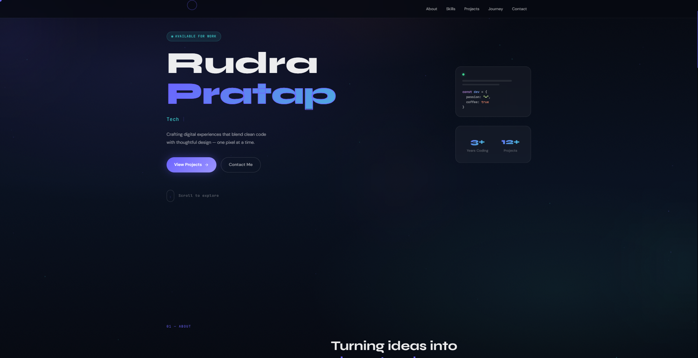

# Personal-Portfolio
Crafting digital experiences that blend clean code with thoughtful design — one pixel at a time. [PORTFOLIO]
# 🚀 Developer Portfolio Template

A modern **developer portfolio template** designed for developers who want to create a beautiful portfolio quickly without spending hours designing from scratch.

This template is perfect for **lazy coders** who just want to plug in their information and deploy a professional looking portfolio.

---

## ✨ Features

* Modern UI design
* Responsive layout
* Easy to customize
* Ready to deploy
* Clean code structure
* Fast performance

---

## 📸 Preview



---

## ⚙️ How to Use

Clone the repository

```
git clone https://github.com/rudra-codess/your-repo-name.git
```

Go to project folder

```
cd your-repo-name
```

Install dependencies

```
npm install
```

Run development server

```
npm run dev
```

---

## 🛠 Customization

Edit the following files to personalize your portfolio:

* Personal details
* Projects section
* Skills section
* Social links

---

## 🚀 Deployment

You can easily deploy this portfolio using:

* Vercel
* Netlify
* GitHub Pages

---

## 🤝 Contributing

Contributions are welcome. Feel free to fork the repo and improve the template.

---

## 👨‍💻 Author

Rudra Pratap
Developer | Web Enthusiast
